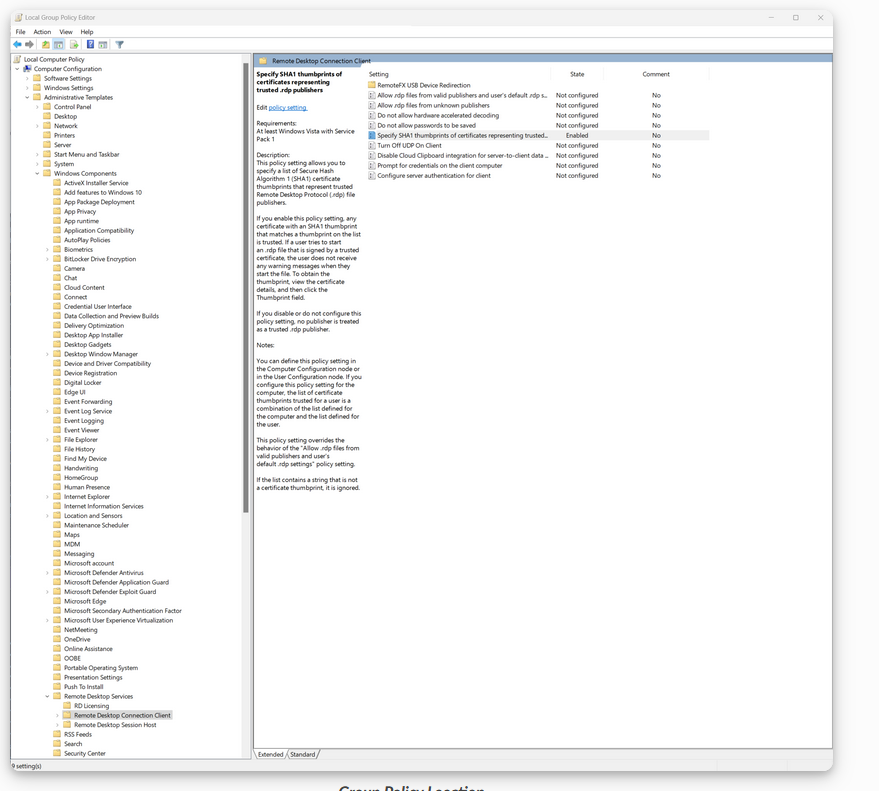
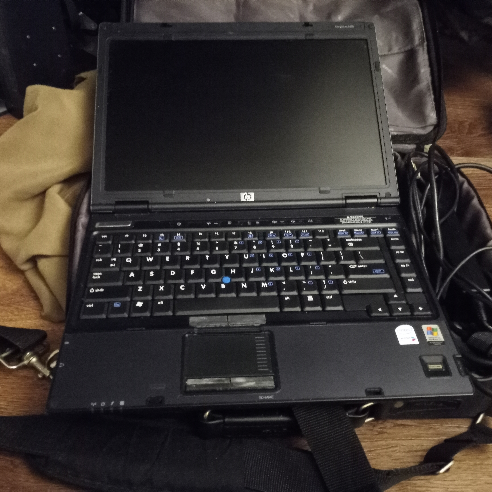
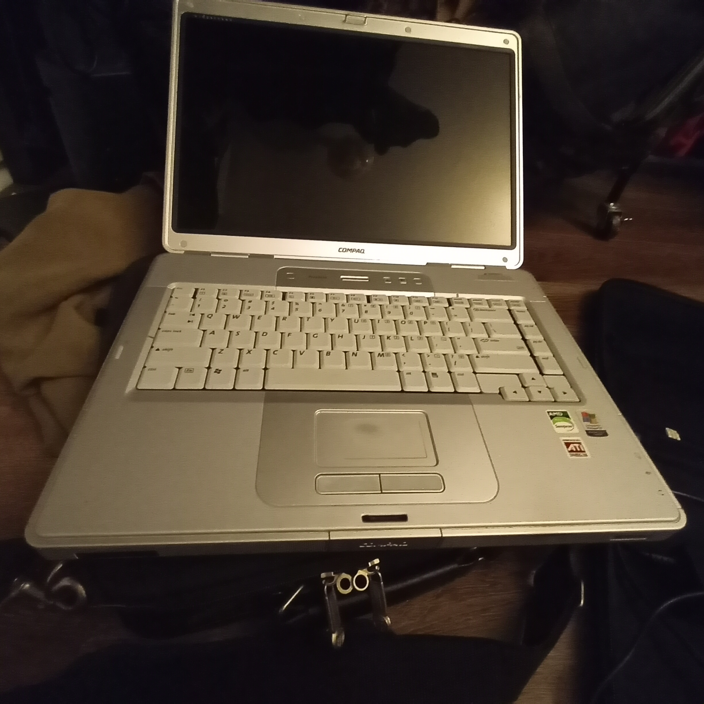
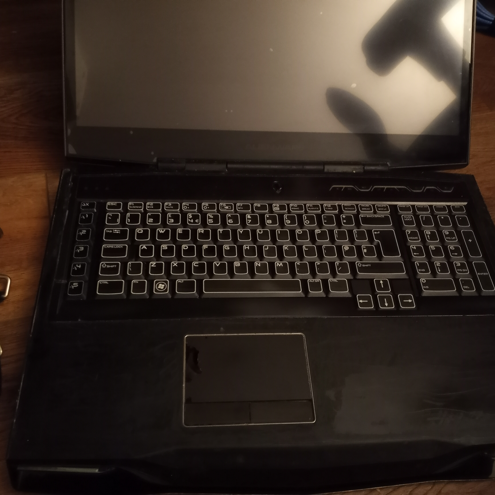
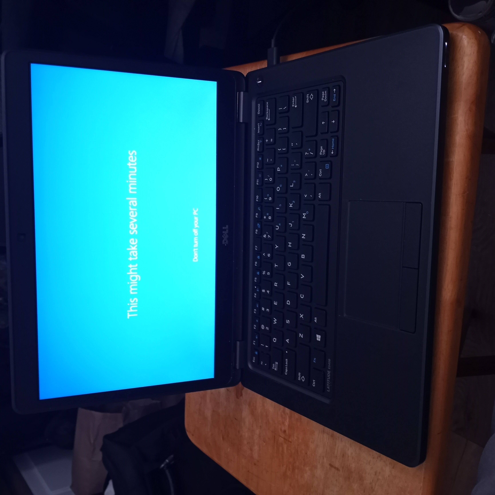
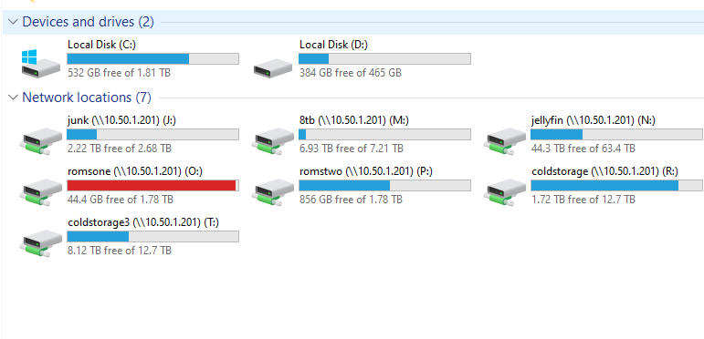

# proxmox
Setting up proxmox cyberlab and Establishing an immutable, unhackable infrastructure.

Establishing an immutable, unhackable infrastructure necessitates the deployment of a rigorously compartmentalized, zero-trust architecture fortified by cryptographically verifiable integrity mechanisms. This paradigm incorporates hardware-enforced secure enclaves, kernel-level mandatory access controls, and tamper-evident audit trails to ensure systemic inviolability. Immutable infrastructure principles dictate that all configuration states are declaratively defined and instantiated via reproducible, version-controlled artifacts, thereby precluding unauthorized mutation. Network segmentation is enforced through micro-perimeterization and policy-driven software-defined boundaries, while all ingress and egress traffic is subjected to deep packet inspection and behavioral anomaly detection. The system is further hardened by ephemeral compute instances, immutable containers, and continuous compliance validation against cryptographic baselines, rendering it impervious to conventional attack vectors and lateral movement.

# Quick start with KASM
Installing Kasm Workspaces in Docker is designed to quickly deploy secure, browser-accessible desktops and applications. 

How to:

 First, ensure your system meets the minimum requirements: at least 2 CPU cores, 4GB of RAM, and 50GB of storage. You'll need Docker and Docker Compose installed beforehand.

 

 A few examples of what my personal kasm runs:

 Let’s Encrypt – SSL certificate provisioning for secure access
 Kubernetes - ( for testing)
 kali-rolling ( a 1 time test kali or attack target)
 fedora - ( attack target)
 auto-rdp proxy 
 firefox
 chromium
 edge
 chrome
 brave
 vlc movie tester if unsure if its infected
 only office - testing of infected files
 Discord - for burner account or target
 filezilla that does not keep track of where it connect: good for game saves

 slack
 anydesk (as I do not trust it)

 Remnux: Kept completely isolated and freshly instantiated with each use to preserve forensic data. ( note:  This installs offline and has no networking connection to the actual container in case of severe infection or forensic data does not change. This facilitates the reverse engineering of malicious code, including malware, spyware, viruses, and related threat vectors. )

 # Layers of protection intro to ludus:

Installing Ludus with Proxmox allows you to deploy advanced cybersecurity labs and testing environments with automation and flexibility.

# 🛠️ Prerequisites
Ensure your Proxmox host meets the following:
- Proxmox 8 or 9
- Minimum 32 GB RAM
- 200 GB+ disk space (NVMe recommended)

# Installation Steps

1. Prepare the Proxmox Host
   - Start with a clean Proxmox installation.
   - Avoid pre-configuring custom networking or services.

2. Download the Installer
   - Visit: https://docs.ludus.cloud/docs/deployment-options/proxmox/
   - Download the official Ludus install script.

3. Run the Installer
   - Execute the script with root privileges.
   - The script will:
     - Extract files to /opt/ludus
     - Install required packages:
       - ansible, packer, dnsmasq, sshpass, curl, jq
       - iptables-persistent, gpg-agent, dbus, vim
     - Install Python packages:
       - proxmoxer, requests, netaddr, pywinrm, dnspython, jmespath
     - Create Proxmox groups:
       - ludus_users, ludus_admins
     - Create pools:
       - SHARED, ADMIN
     - Set up networking: (example::)
       - vmbr1000 (192.0.2.0/24)
       - WireGuard wg0 (198.51.100.0/24)

4. Post-Install Configuration
   - Access the Ludus web interface.
   - Configure ranges, users, and lab environments.
   - Deploy prebuilt templates or create custom ones.

#  How Ludus Works with Proxmox

- Ludus uses Proxmox to automate deployments.
- Each lab is defined by a YAML config and built with Ansible and Packer.
- WireGuard provides secure remote access to ranges.
- Labs can include Windows domains, Linux servers, vulnerable apps, and more.
- Supports ephemeral labs, snapshots, and forensic isolation.
- Ideal for cybersecurity training, malware analysis, and penetration testing.

# Mix and match: 

This allows me to use WireGuard to access the systems, but by default, it prevents them from communicating with each other. It locks down the network and allows no inbound or outbound traffic without a WireGuard connection. Combine that with an immutable file system like SecureBlue or a one-time-use Remnux, and the system becomes virtually impossible to hack, as it resets after every use.

# Setting up kali as "kalia"

This allows me to copy the physical machine. In this case, I used Clonezilla to perform a 1-to-1 copy of the 120 GB drive. I did a full clone, which keeps my VM relevant and also serves as a backup—including all commands and notes I’ve taken or modified. I often change configurations depending on the security level of the jobs I’m working on. This setup also lets me use the actual VM via RDP from a less powerful system while still achieving over 10 Gbps connection speeds. As a result, even systems with minimal RAM and no physical hard drive can still run a modern operating system.

# E-Waste to hacking box:

Example of complete e-waste being transformed into a secure, immutable system that functions as a school, hacking, and work PC.

2 gigs of ram 2 core minimal networking 90gb hard drive:

1 core x86 483 mb of ram 60gb ide HDD, almost 960mhz processer: back from early 2000 or late 90's (can not even run windows 7) 

formerly broken alienware-mx18 from 2016(ish)

Now works perfectly on its own or can be used as RDP box (bare-metal) kali x64 

Lastly this is the "junk top"  

I got this for school only just for if I lose power

# omv
To summarize, I use OMV (OpenMediaVault) for file sharing over the network, with the main PC running an OMV virtual machine. This VM simply shares a few passed-through drives. The reason for this setup is that my array originally ran on OMV bare metal, and I haven’t had the funds to replace the entire system yet.

# Can't find myself oh here I am:
DuckDNS: This is an LXC container with a single purpose—pinging DuckDNS. It allows me to maintain my key and subdomain. It's also connected to the client side of my WireGuard setup, so if my IP changes due to a power outage while I'm away, I can still access and configure everything remotely. NAT is bypassed using a simple Tailscale setup, which reduces the number of exposed services and helps minimize my attack surface.

Heimdall—mostly because I’m lazy. Although it’s currently turned off, it helps me find services when I don’t remember their IP addresses, since everything is saved as a bookmark. It links to all the essential tools like Docker and various containerized services. This setup is for internal use only.

# AMP:
AMP is a game management system that allows me to run various servers, such as ARK, and cluster them together. I currently have an 18-server ARK cluster, enabling players to travel seamlessly from one map to another without any issues.

# Docker:

DOCKER: This is my main Docker instance. It runs lightweight applications like Firefox, which is forced through a VPN to ensure anonymity when streaming or checking links. I also use a downloader and FileZilla with a designated save area to manage game saves from AMP and store them in a backup location. Lastly, I run Watchtower, which automatically updates containers and uses a cron job to delete old files—so I never have to manually check or maintain it.

# MovemeONLY
This is a simple Windows 10 setup with permissions granted to the main drives for copy-paste access. It allows file transfers over the network without needing to keep another PC powered on. Since it's intraband, the transfer speeds are faster and more efficient.

# Jellyfin
Jellyfin: This is my main setup for both Jellyfin and Plex VMs. Their sole purpose is to stream movies hosted on the OMV server. Plex has read-only access, while Jellyfin has write permissions for metadata (.info files) in the main storage area.

# windows 10 / windowsinfected
Windows 10 serves as a clean target that I use as a template for other systems or as a test environment when I'm unsure about certain configurations. Wazuh monitors this setup and alerts me to any invisible changes. The "infected" instance is an actual target—this particular copy was compromised by a proctor at Western Governors University (WGU). I was able to forensically prove the attack occurred, which ultimately led to receiving a free education in lieu of pursuing legal action.

# kali school
Kali School is a copy of my main Kali system, designed for use on lower-powered laptops or when I need to be mobile. I can take a cheap, disposable laptop that connects to my home network and runs a VM (if password access is granted) using WireGuard and Tailscale. This setup is heavily restricted—it’s not allowed to make significant changes and cannot be used as a backdoor. The VM operates in isolation 99% of the time, especially when I’m traveling.
( also used for THM, HTB, normal school, and other targets)

# Scan-hacks
Scan Hacks is my one-stop scanning setup for running multiple tools simultaneously, all while using a Kali bare-metal box. It’s configured with Nessus, Greenbone, SysRaptor, and a few other useful utilities to support blue, red, and purple team operations.

# kasm / secureblue
SecureBlue and Kasm are part of the immutable system I mentioned earlier. I also use tools like Tails, and when traveling or working on jobs that require it, I rely on Qubes OS. Depending on the task, I may run more than one type of virtual machine to suit the specific action required.